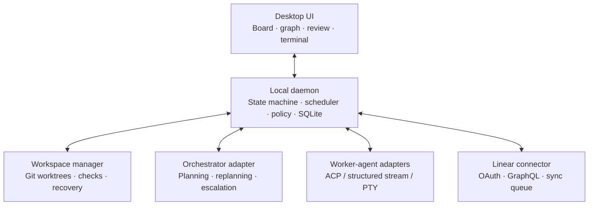

# System architecture

## Component map

## Technology boundary

The desktop application uses Tauri 2 as its IPC/security boundary, React/TypeScript for presentation, and a Rust core for state, policy, workspace, and connector behavior. React must not contain authoritative task transitions or scheduling rules. See [ADR 0005](../decisions/0005-tauri-react-rust-stack.md).

## Authority boundaries

- The **daemon** owns durable task and dependency state. It is the only component that can make a state transition or schedule a task.
- The **UI** is a client of the daemon. UI disconnection, a backgrounded window, or terminal rendering failure must not affect task execution.
- An **agent adapter** translates one agent's lifecycle into normalized events. Its events are input to guarded transitions, not state changes by themselves.
- The **workspace manager** owns creation, health validation, and cleanup of task worktrees. It never assumes that symlinked ignored files are safe for every project.
- The **Linear connector** uses an outbox/inbox and reconciliation rules. It cannot mutate the core task graph directly without validation.

## Core entities

| Entity | Key responsibilities |
| --- | --- |
| `Project` | A declared repository boundary, policy set, and base ref |
| `Board` | A planning/execution view over work items, optionally linked to a Linear project/team |
| `WorkItem` | Task specification, state, evidence, budgets, and external links |
| `Dependency` | Typed directed edge between work items |
| `Execution` | One worker-agent attempt; session, workspace, status, cost, and event stream |
| `Workspace` | Worktree path, Git ref, lifecycle, health checks, and isolation policy |
| `Evidence` | Checks, diffs, commits, PRs, review decisions, and completion report |
| `ExternalLink` | Stable mapping to a Linear issue or future connector resource |
| `SyncEvent` | Idempotent inbound/outbound connector event and reconciliation outcome |
| `PolicyDecision` | Allow, deny, or require-approval result with reason and audit record |

## Agent adapter contract

Each adapter must expose capability discovery and these normalized operations:

`discover`, `start`, `resume`, `send_feedback`, `interrupt`, `terminate`, `stream_events`, and `health_check`.

Normalized events include `activity`, `approval_requested`, `awaiting_input`, `awaiting_review`, `completed`, `failed`, `interrupted`, and `usage_updated`.

Adapters may use a structured protocol when available and a constrained PTY fallback otherwise. They must preserve a resumable session identifier where the agent supports it, report unsupported capabilities explicitly, and never rely on terminal text alone to infer successful completion.

## Persistence and recovery

The daemon persists append-only domain events and materialized state transactionally. On launch it reconciles recorded state against Git worktrees and live agent processes, then marks uncertain runs as `Interrupted` with recovery options. It must not move cards to a terminal state simply because the desktop UI or terminal stream disconnected.
