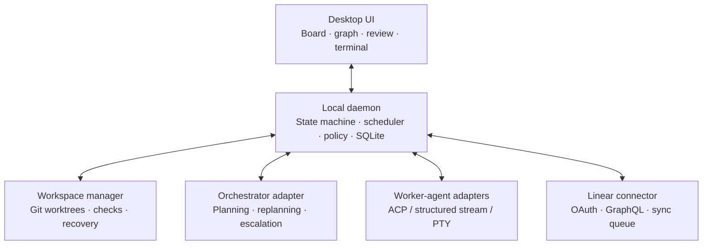

# System architecture

## Component map

## Technology boundary

The desktop application uses Tauri 2 as its IPC/security boundary, React/TypeScript for presentation, and a Rust core for state, policy, workspace, and connector behavior. React must not contain authoritative task transitions or scheduling rules. See [ADR 0005](../decisions/0005-tauri-react-rust-stack.md).

## Authority boundaries

- The **daemon** owns durable task and dependency state. It is the only component that can make a state transition or schedule a task.
- The **UI** is a client of the daemon. UI disconnection, a backgrounded window, or terminal rendering failure must not affect task execution.
- An **agent adapter** translates one agent's lifecycle into normalized events. Its events are input to guarded transitions, not state changes by themselves.
- The **workspace manager** owns creation, health validation, and cleanup of task worktrees. It creates them in a declared root outside the base repository, verifies the assigned root and branch before launch, and never assumes that symlinked ignored files are safe for every project.
- The **Linear connector** uses an outbox/inbox and reconciliation rules. It cannot mutate the core task graph directly without validation.

## Core entities

| Entity | Key responsibilities |
| --- | --- |
| `Project` | A declared repository boundary, policy set, and base ref |
| `Board` | A planning/execution view over work items, optionally linked to a Linear project/team |
| `WorkItem` | Task specification, state, evidence, budgets, and external links |
| `Dependency` | Typed directed edge between work items |
| `Execution` | One worker-agent attempt; session, workspace, status, cost, and event stream |
| `Workspace` | Worktree path, Git ref, lifecycle, health checks, and isolation policy |
| `Evidence` | Checks, diffs, commits, PRs, review decisions, and completion report |
| `ExternalLink` | Stable mapping to a Linear issue or future connector resource |
| `SyncEvent` | Idempotent inbound/outbound connector event and reconciliation outcome |
| `PolicyDecision` | Allow, deny, or require-approval result with reason and audit record |

## Agent adapter contract

Each adapter must expose capability discovery and these normalized operations:

`discover`, `start`, `resume`, `send_feedback`, `interrupt`, `terminate`, `stream_events`, and `health_check`.

Normalized events include `activity`, `approval_requested`, `awaiting_input`, `awaiting_review`, `completed`, `failed`, `interrupted`, and `usage_updated`.

Adapters may use a structured protocol when available and a constrained PTY fallback otherwise. They must preserve a resumable session identifier where the agent supports it, report unsupported capabilities explicitly, and never rely on terminal text alone to infer successful completion.

The first concrete local process boundary accepts an executable plus structured arguments, sends task briefs over stdin, and reads bounded JSON-lines events from stdout. It avoids a production shell, discards raw stderr, rejects malformed/oversized/out-of-order output as a normalized failure, and does not claim process-tree interruption until a platform adapter implements it. It cannot receive feedback, so an `awaiting_input` or approval event is persisted and then fails the attempt rather than falsely leaving it interactive. See [ADR 0013](../decisions/0013-structured-process-agent-adapter.md).

Adapter events are sequenced and deduplicated before they are offered to the daemon. The execution-event controller accepts events only for an activated execution with an attached session, persists a monotonic usage/status checkpoint, and records significant input, failure, interruption, and completion reports as bounded evidence. `completed` and `awaiting_review` request the work item's `Review` state; no adapter event can request `Done`. The daemon still applies its guarded transition and evidence policy. A repeated review report is evidence, not an illegal self-transition.

## Persistence and recovery

The daemon persists append-only domain events and materialized state transactionally. On launch it reconciles recorded state against Git worktrees and live agent processes, then marks uncertain runs as `Interrupted` with recovery options. It must not move cards to a terminal state simply because the desktop UI or terminal stream disconnected.

## Local board command boundary

The desktop initializes one local SQLite-backed board service in the application data directory. Typed Tauri commands create projects, boards, work items, direct-program profiles, worker attempts, execution progress, and evidence; add validated dependencies; transition work items through the authoritative state machine; and return a board snapshot. The launch runtime owns each child process and polling loop outside the React window: it performs policy authorization before worktree provisioning, verifies the assigned worktree, and atomically attaches a started session while moving the task to `Running`. Each snapshot includes an ordered, bounded activity trail plus the most recent 20 durable execution attempts and evidence records per task, so reopening the board preserves useful review context without exposing raw transcripts or loading an unbounded history view. Execution identity is immutable; a pending attempt cannot become running without an attached session; and session identity, usage, event sequence, and lifecycle status can progress only monotonically through a guarded store update. The React client can render this snapshot and request a command, but cannot write SQLite directly, bypass ownership checks, create a hard-dependency cycle, rewrite an execution's identity, or mark a task done without the required evidence. The service lock only protects synchronous local state work and never surrounds external network or agent I/O. See [ADR 0012](../decisions/0012-local-board-command-boundary.md).

## Policy enforcement and audit

Before a scheduler or worker boundary performs a side effect, the daemon sends a typed action and current usage through the policy gate. The gate limits tool scopes, new-execution concurrency, agent turns, duration, and cost; it uses the stricter project or work-item budget. The worker-launch path proceeds only after it has durably recorded an allow; denied or approval-required decisions prevent both worktree provisioning and process start, regardless of the agent's prompt text. The current desktop MVP recognizes the `standard` policy set with one concurrent execution per project; persisted custom policy-set administration is a planned follow-up.

Protected Git actions require a durable, exact approval for the project, work item, and action. The policy decision and approval records live alongside durable task state in SQLite. A policy-audit write failure prevents authorization, so the board can always explain whether the action was allowed, denied, or waiting for a person.

## Plan preview and scheduling

The orchestrator supplies a typed plan proposal, not an execution command. The daemon renders it as a preview containing every task, its acceptance criteria and budget, its typed dependencies, the hard-dependency critical path, deterministic parallel stages, and unresolved assumptions. The user must confirm that exact plan with an identity and timestamp before the scheduler can issue any launch authorization.

Each daemon scheduler tick consumes durable work-item progress, current usage, and a repository execution-capacity value; it has no UI input. It takes dependency-safe ready work in a deterministic order, defers work that does not fit in repository capacity, then sends each remaining candidate through the policy gate. A launch is only the policy gate's opaque authorization: the worker-adapter boundary must require it immediately before it starts an agent. This keeps UI availability, provider choice, worktree capacity, and policy approval separate while preserving one authoritative scheduling decision. See [ADR 0009](../decisions/0009-confirmed-plan-scheduler.md).
